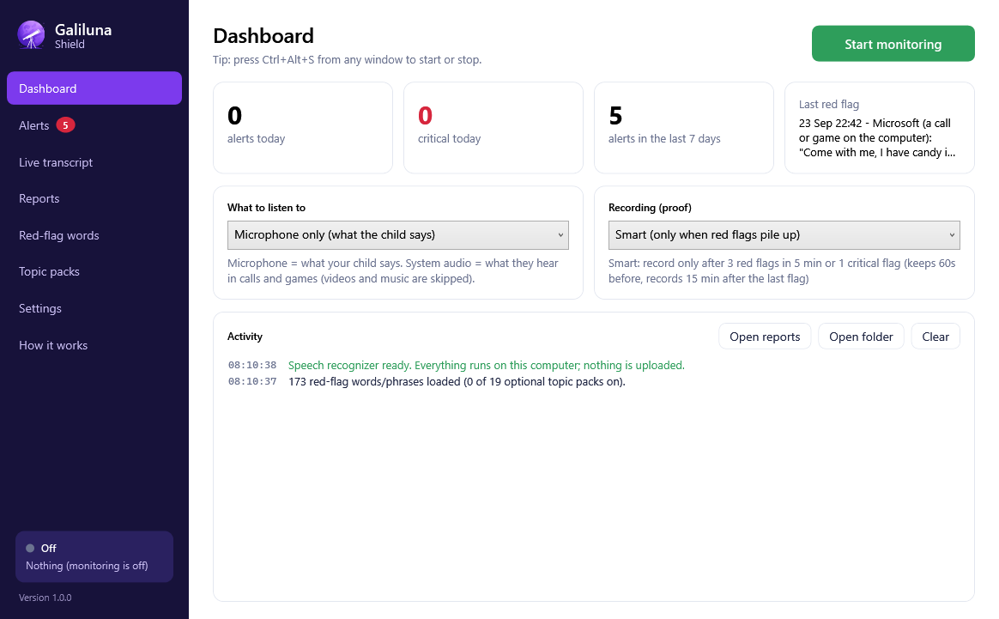
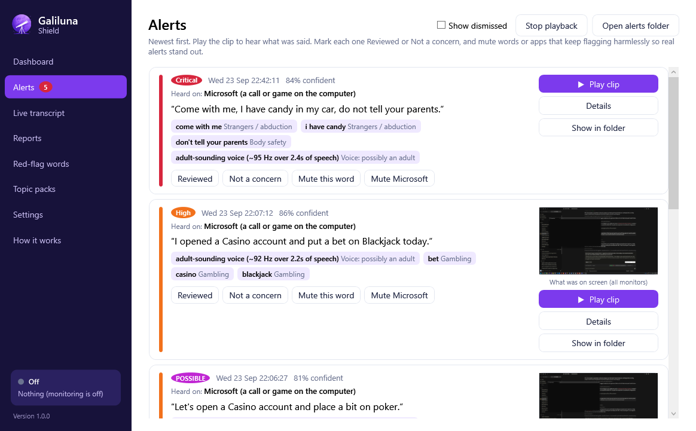
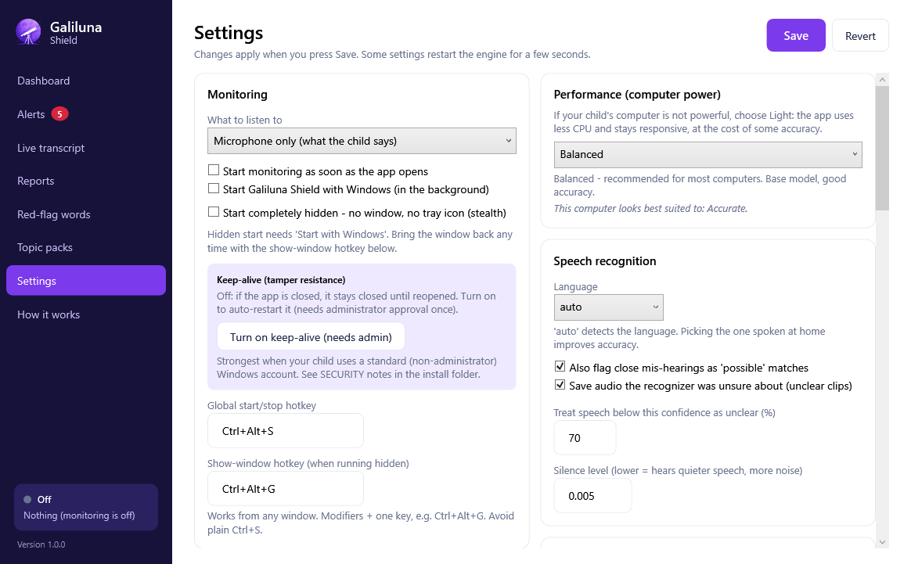

<p align="center">
  
</p>
<h1 align="center">Galiluna Shield</h1>
<p align="center"><b>Keeps an ear out for your child.</b><br/>
Offline speech monitoring for Windows with red-flag alerts, proof recording and evidence-grade reports.</p>

---

Galiluna Shield listens to what a child says (microphone) and hears (calls and games), turns speech into
text **entirely on the computer**, and raises an alert the moment a red-flag word or phrase appears: body
safety, strangers, online grooming, self-harm, violence, bullying, drugs, personal information, scams.
Every alert saves the sentence, its context, the audio clip and a tamper-evident fingerprint. When flags
pile up, Smart recording captures the whole situation, including the minute before it started.

Nothing is uploaded. There is no account, no cloud, no telemetry.




## For parents

- **Install** `installer/out/GalilunaShield-<version>-x64.msi` on any 64-bit Windows 10 (2004+) or
  Windows 11 PC. No other software needed. First run downloads the speech model once (~150 MB).
- **Read** the [Parent's Guide](docs/PARENTS-GUIDE.md) for the first five minutes, the modes, alerts,
  recording, reports and the parent PIN.
- **Privacy**: see [PRIVACY.md](docs/PRIVACY.md). Everything stays in `Documents\Galiluna Shield`.

## What's in the box

| | |
|---|---|
| **Desktop app** (`GalilunaShield.exe`) | Dashboard with one-button start/stop, live alerts with playback, live transcript, reports, red-flag word editor, settings, tray icon with notifications, parent PIN, start with Windows. |
| **Listening modes** | Microphone (what the child says) · System audio per program (Discord, Teams, games; browsers and media players skipped, any output device) · Both. Follows whichever microphone actually has sound. |
| **Detection** | 170+ curated words/phrases in 11 categories with severities, editable in plain text and hot-reloaded. Whole-word, accent/punctuation-insensitive, wildcard endings, plus fuzzy matching for near mis-hearings. |
| **Imperfect speech handled** | Confidence shown per line; low-confidence and unrecognizable speech saved as "unclear" clips instead of being dropped. Beam-search decoding for fewer mis-hearings. |
| **Where & what** | Every alert names the program it was heard in (Discord, Roblox, a game) and the time, and captures a screenshot of **all monitors** at that moment. |
| **Who is talking** | Pitch analysis warns when an adult-sounding voice is speaking to the child in a call or game. |
| **Topic packs** | 17 one-click lists (religions, gambling, dating, horror, weapons, heavy cursing, politics, occult, online-safety…) the parent enables per family; custom packs supported. A "cursing a lot" burst rule flags pile-ups. |
| **Stays on** | Optional start-hidden-with-Windows (no window, no tray), show-window hotkey, and a program-event log that records every stop, Windows shutdown or unclean exit so a bypass is visible. |
| **Fits the PC** | Light / Balanced / Accurate performance presets for weak-to-fast computers; auto-delete of old audio with a configurable retention window; configurable recording length. |
| **Proof** | Per-alert clip + SHA-256, context lines, screenshot, JSON log. Smart recording with pre-roll and a parent-set calm-down margin, triggered by alert bursts or a single critical flag; or continuous recording of mic / system / both. |
| **Consent & legal** | First-run consent + age gate (blocks app and CLI until accepted); shipped Privacy Policy, EULA, Acceptable-Use and Cookie policies (attorney-review templates); timestamped consent record. |
| **Triage** | Mark alerts Reviewed / Not a concern, mute a word or an app, new-alert badge, show-dismissed filter — so a normal gamer's "kill/shoot" noise doesn't bury real alerts. |
| **Encryption at rest** | Optional AES/DPAPI + PIN-entropy encryption of clips, recordings and screenshots; decrypt-on-view inside the app; reports link to the app for encrypted media. |
| **Tamper resistance** | Parent PIN gate, keep-alive SYSTEM watchdog that relaunches on kill, and tamper/kill/shutdown logging so any bypass is visible. Strongest with the child on a standard account (see [SECURITY.md](docs/SECURITY.md)). |
| **Reaches the parent** | Remote alerts by email and push (ntfy / Telegram / Slack / Discord), sent from the PC with no server of ours; a local **parent web dashboard** (ASP.NET Core) the parent opens from their phone on the home wifi to review alerts, play clips and see screenshots, PIN-protected, decrypting encrypted evidence on the fly. |
| **Onboarding** | First-run wizard sets age-appropriate defaults so a non-technical parent is protected in a minute. |
| **Evidence pack** | One-click export of a tamper-evident ZIP (clips, screenshots, transcripts, report, SHA-256 manifest) for a school, counsellor or the police. |
| **Reports** | Self-contained HTML (no scripts, works offline, dark-mode aware) with severity/category/hour/source breakdowns, timeline with embedded audio, unclear clips, recordings; CSV export alongside. |
| **Command-line engine** (`galiluna.exe`) | Same engine headless: `galiluna --start --mode both --record smart`, `galiluna --report week`. |
| **Installer** | WiX 5 MSI, self-contained (.NET bundled), Start-menu/desktop shortcuts, upgrade in place, launch on finish. |

<p align="center">
  
  
</p>

## For developers

```bash
dotnet build
dotnet test
dotnet run --project GalilunaShield.App
```

Build the installer (publishes self-contained, runs tests, compiles the MSI):

```powershell
.\build-installer.ps1
```

See [docs/BUILDING.md](docs/BUILDING.md) for the solution layout, architecture notes, file locations
and code-signing guidance. Console usage is in [GalilunaShield/README.md](GalilunaShield/README.md).

## Before selling

- **Sign** the executables and the MSI with an Authenticode certificate; unsigned installers trigger
  SmartScreen warnings and weaken tamper resistance.
- **Have a lawyer review** the documents in [`legal/`](legal/) (Privacy Policy, EULA, Acceptable Use,
  Cookie Policy) and the consent wording, per market; recording-consent laws vary sharply. They are
  drafted templates, not legal advice.
- **Read** [docs/SECURITY.md](docs/SECURITY.md) for the honest tamper-resistance model and its limits.
- **Tune** `redflags.txt` and the topic packs for your market and languages; Whisper handles 90+ languages.
- **Still missing for a full product:** remote notifications to the parent's phone (today alerts are on the
  child's PC), text/chat monitoring, and a licence/activation and auto-update system.

## Credits

Artwork (icon and hero illustration) generated with Higgsfield via the CentralWiki generation API;
sources in [docs/art](docs/art). Speech recognition by [whisper.cpp](https://github.com/ggerganov/whisper.cpp) via
[Whisper.net](https://github.com/sandrohanea/whisper.net); audio via [NAudio](https://github.com/naudio/NAudio).
See [installer/THIRD-PARTY-LICENSES.txt](installer/THIRD-PARTY-LICENSES.txt).
